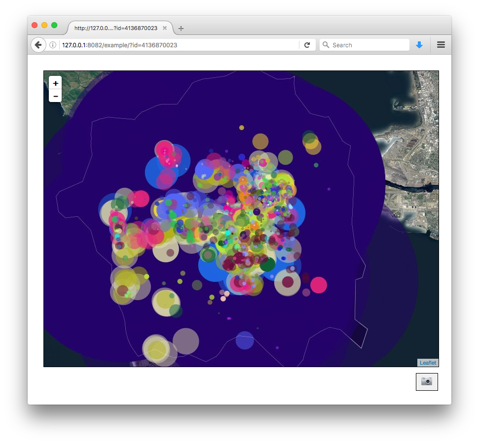
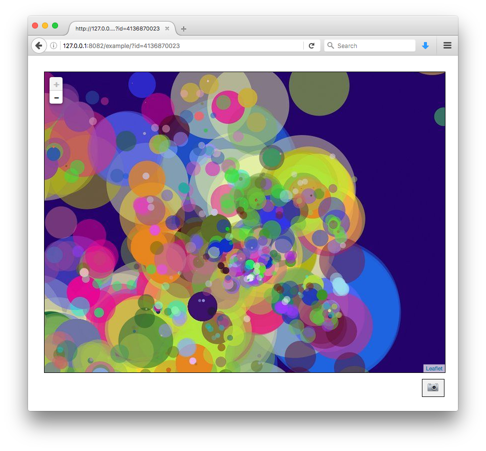
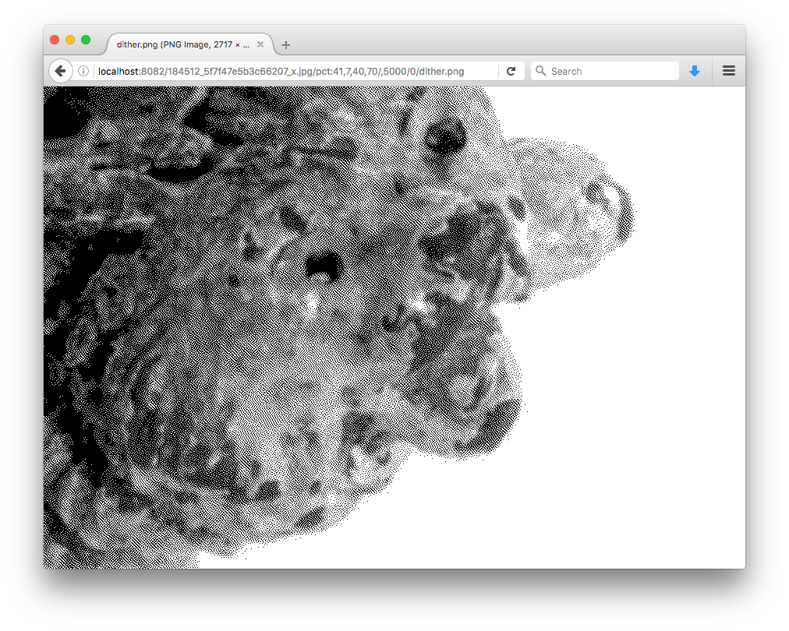
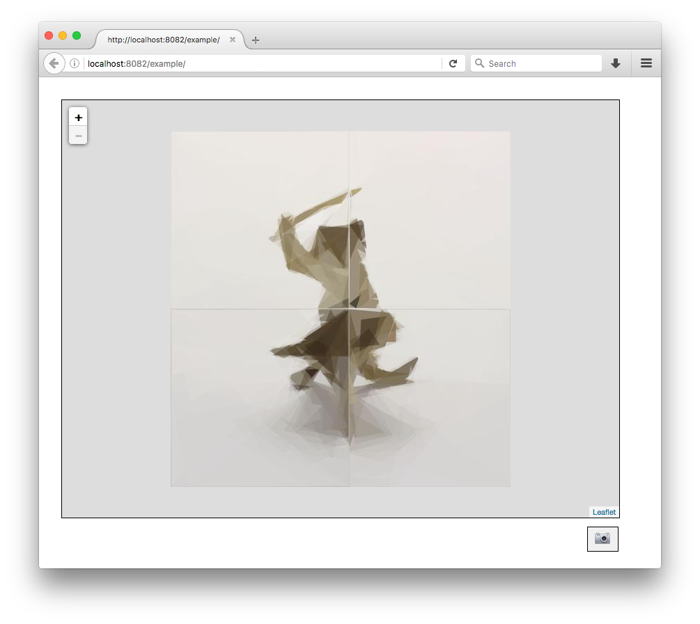
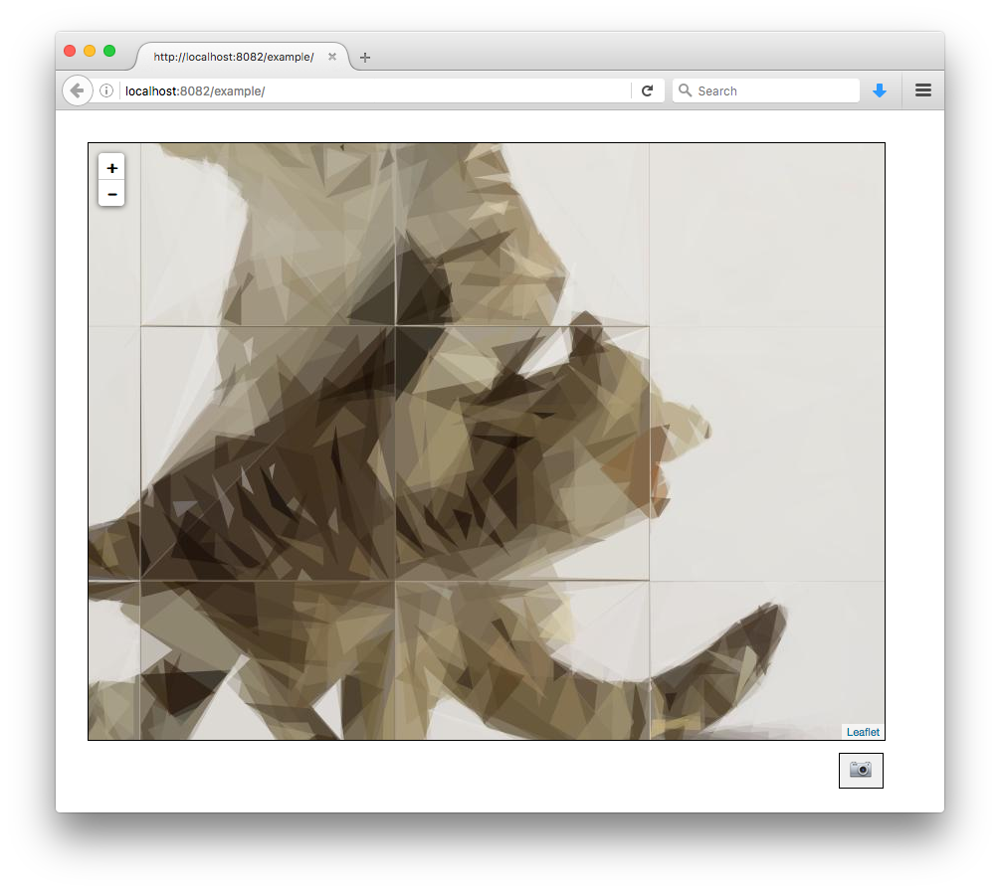
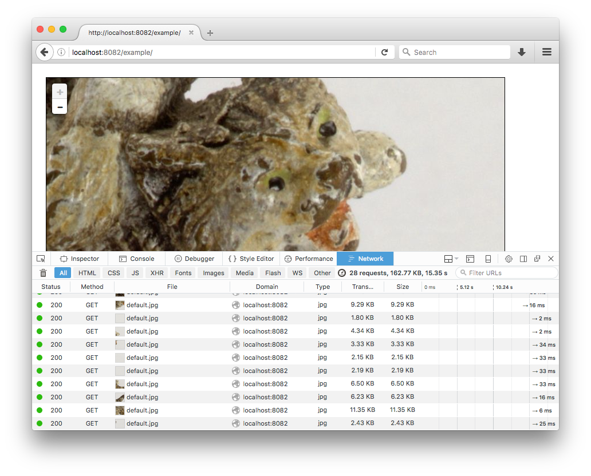

# go-iiif


## What is this?

This began as a fork of [@greut's iiif](https://github.com/greut/iiif) package that moves all of the processing logic for the [IIIF Image API](http://iiif.io/api/image/) in to discrete Go packages and defines source, derivative and graphics details in a [JSON config file](README.md#config-files). There is an additional caching layer for both source images and derivatives.

I did this to better understand the architecture behind (and to address my own concerns about) version 2 of the [IIIF Image API](http://iiif.io/api/image/2.1/index.html).

For the time being this package will probably not support the other IIIF Metadata or Publication APIs. Honestly, as of this writing it may still be lacking some parts of Image API but it's a start and it does all the basics.

_And by "forked" I mean that [@greut](https://github.com/greut) and I decided that [it was best](https://github.com/greut/iiif/pull/2) for this code and his code to wave at each other across the divide but not necessarily to hold hands._

## Important

`go-iiif` was first written with the [libvips](https://github.com/jcupitt/libvips) library and [bimg](https://github.com/h2non/bimg/) Go wrapper for image processing. `libvips` is pretty great but it introduces non-trivial build and setup requirements. As of version 2.0 `go-iiif` no longer uses `libvips` by default but instead does all its image processing using native (Go) code. This allows `go-iiif` to run on any platform supported by Go without the need for external dependencies.

Support for alternative image processing libraries, like `libvips` is supported through the use of "drivers" (similar to the way the Go `database/sql` package works). Drivers are discussed further below.

If you want or need to use `libvips` for image processing you should use the [go-iiif-vips](#) package.

## Setup

You will need to have both `Go` (specifically a version [1.12](https://golang.org/dl/) or higher) and the `make` programs installed on your computer. Assuming you do just type:

```
make cli-tools
```

All of this package's dependencies are bundled with the code in the `vendor` directory.

## Drivers

As of version 2.0 `go-iiif` no longer uses `libvips` by default but instead does all its image processing using native (Go) code. Support for alternative image processing libraries, like `libvips` is supported through the use of "drivers" (similar to the way the Go `database/sql` package works).

A driver needs to support the `driver.Driver` interface which looks like this:

```
import (
	iiifcache "github.com/go-iiif/go-iiif/cache"
	iiifconfig "github.com/go-iiif/go-iiif/config"
	iiifsource "github.com/go-iiif/go-iiif/source"
)

type Driver interface {
	NewImageFromConfigWithSource(*iiifconfig.Config, iiifsource.Source, string) (iiifimage.Image, error)
	NewImageFromConfigWithCache(*iiifconfig.Config, iiifcache.Cache, string) (iiifimage.Image, error)
	NewImageFromConfig(*iiifconfig.Config, string) (iiifimage.Image, error)
}
```

The idea here is that the bulk of the `go-iiif` code isn't aware of who or how images are _actually_ being processed only that it can reliably pass around things that implement the `image.Image` interface (the `go-iiif` image interface, not the Go language interface).

Drivers are expected to "register" themselves through the `driver.RegisterDriver` method at runtime. For example:

```
package native

import (
	iiifdriver "github.com/go-iiif/go-iiif/driver"
)

func init() {

	dr, err := NewNativeDriver()

	if err != nil {
		panic(err)
	}

	iiifdriver.RegisterDriver("native", dr)
}
```

And then in your code you might do something like this:

```
import (
	"context"
	_ "github.com/go-iiif/go-iiif/native"
	iiifconfig "github.com/go-iiif/go-iiif/config"
	iiifdriver "github.com/go-iiif/go-iiif/driver"	
)

ctx := context.Background()
	
config_bucket, _ := bucket.OpenBucket(ctx, "file:///etc/go-iiif")

cfg, _ := config.NewConfigFromBucket(ctx, config_bucket, "config.json")

driver, _ := iiifdriver.NewDriverFromConfig(cfg)
```

```
    "graphics": {
	"source": { "name": "native" }
    }
```

## Usage

`go-iiif` was designed to expose all of its functionality outside of the included tools although that hasn't been documented yet. The source code for the [iiif-tile-seed](cmd/iiif-tile-seed.go), [iiif-transform](cmd/iiif-transform.go) and [iiif-process](cmd/iiif-process.go) tools is a good place to start poking around if you're curious.

## Tools

### iiif-process

```
> ./bin/iiif-process -h
Usage of ./bin/iiif-process:
  -config string
    	Path to a valid go-iiif config file.
  -instructions string
    	Path to a valid go-iiif processing instructions file.
  -report
    	Store a process report (JSON) for each URI in the cache tree.
  -report-name string
    	The filename for process reports. Default is 'process.json' as in '${URI}/process.json'. (default "process.json")
  -uri value
    	One or more valid IIIF URIs.
```

Perform a series of IIIF image processing tasks, defined in a JSON-based "instructions" file, on one or more (IIIF) URIs. For example:

```
$> ./bin/iiif-process -config config.json -instructions instructions.json -uri source/IMG_0084.JPG | jq

{
  "source/IMG_0084.JPG": {
    "dimensions": {
      "b": [
        2048,
        1536
      ],
      "d": [
        320,
        320
      ],
      "o": [
        4032,
        3024
      ]
    },
    "palette": [
      {
        "name": "#b87531",
        "hex": "#b87531",
        "reference": "vibrant"
      },
      {
        "name": "#805830",
        "hex": "#805830",
        "reference": "vibrant"
      },
      {
        "name": "#7a7a82",
        "hex": "#7a7a82",
        "reference": "vibrant"
      },
      {
        "name": "#c7c3b3",
        "hex": "#c7c3b3",
        "reference": "vibrant"
      },
      {
        "name": "#5c493a",
        "hex": "#5c493a",
        "reference": "vibrant"
      }
    ],
    "uris": {
      "b": "source/IMG_0084.JPG/full/!2048,1536/0/color.jpg",
      "d": "source/IMG_0084.JPG/-1,-1,320,320/full/0/dither.jpg",
      "o": "source/IMG_0084.JPG/full/full/-1/color.jpg"
    }
  }
}
```

Images are read-from and stored-to whatever source or derivatives caches defined in your `config.json` file.

#### "instructions" files

An instruction file is a JSON-encoded dictionary. Keys are user-defined and values are dictionary of IIIF one or more transformation instructions. For example:

```
{
    "o": {"size": "full", "format": "", "rotation": "-1" },
    "b": {"size": "!2048,1536", "format": "jpg" },
    "d": {"size": "full", "quality": "dither", "region": "-1,-1,320,320", "format": "jpg" }	
}

```

The complete list of possible instructions is:

```
type IIIFInstructions struct {
	Region   string `json:"region"`
	Size     string `json:"size"`
	Rotation string `json:"rotation"`
	Quality  string `json:"quality"`
	Format   string `json:"format"`
}
```

As of this writing there is no explicit response type for image beyond `map[string]interface{}`. There probably could be but it's still early days.

### iiif-server

```
$> bin/iiif-server -config config.json
2016/09/01 15:45:07 Serving 127.0.0.1:8080 with pid 12075

curl -s localhost:8080/184512_5f7f47e5b3c66207_x.jpg/full/full/0/default.jpg
curl -s localhost:8080/184512_5f7f47e5b3c66207_x.jpg/125,15,200,200/full/0/default.jpg
curl -s localhost:8080/184512_5f7f47e5b3c66207_x.jpg/pct:41.6,7.5,40,70/full/0/default.jpg
curl -s localhost:8080/184512_5f7f47e5b3c66207_x.jpg/full/full/270/default.png
```

`iiif-server` is a HTTP server that supports version 2.1 of the [IIIF Image API](http://iiif.io/api/image/2.1/).

#### Endpoints

Although the identifier parameter (`{ID}`) in the examples below suggests that is is only string characters up to and until a `/` character, it can in fact contain multiple `/` separated strings. For example, either of these two URLs is valid

```
http://localhost:8082/191733_5755a1309e4d66a7_k.jpg/info.json
http://localhost:8082/191/733/191733_5755a1309e4d66a7/info.json
```

Where the identified will be interpreted as `191733_5755a1309e4d66a7_k.jpg` and `191/733/191733_5755a1309e4d66a7` respectively. Identifiers containing one or more `../` strings will be made to feel bad about themselves.

##### GET /{ID}/info.json

```
$> curl -s http://localhost:8082/184512_5f7f47e5b3c66207_x.jpg/info.json | python -mjson.tool
{
    "@context": "http://iiif.io/api/image/2/context.json",
    "@id": "http://localhost:8082/184512_5f7f47e5b3c66207_x.jpg",
    "@type": "iiif:Image",
    "height": 4096,
    "profile": [
        "http://iiif.io/api/image/2/level2.json",
        {
            "formats": [
                "tif",
                "webp",
                "jpg",
                "png"
            ],
            "qualities": [
                "default",
		"dither",
                "color"
            ],
            "supports": [
                "full",
                "regionByPx",
                "regionByPct",
                "sizeByWh",
                "full",
                "max",
                "sizeByW",
                "sizeByH",
                "sizeByPct",
                "sizeByConfinedWh",
                "none",
                "rotationBy90s",
                "mirroring",
                "baseUriRedirect",
                "cors",
                "jsonldMediaType"
            ]
        }
    ],
    "protocol": "http://iiif.io/api/image",
    "width": 3897
}
```

Return the [profile description](http://iiif.io/api/image/2.1/#profile-description) for an identifier.

##### GET /{ID}/{REGION}/{SIZE}/{ROTATION}/{QUALITY}.{FORMAT}

```
$> curl -s http://localhost:8082/184512_5f7f47e5b3c66207_x.jpg/pct:41,7,40,70/,250/0/default.jpg
```

Return an image derived from an identifier and one or more [IIIF parameters](http://iiif.io/api/image/2.1/#image-request-parameters). For example:


##### GET /debug/vars

```
$> curl -s 127.0.0.1:8080/debug/vars | python -mjson.tool | grep Cache
    "CacheHit": 4,
    "CacheMiss": 16,
    "CacheSet": 16,

$> curl -s 127.0.0.1:8080/debug/vars | python -mjson.tool | grep Transforms
    "TransformsAvgTimeMS": 1833.875,
    "TransformsCount": 16,
```

This exposes all the usual Go [expvar](https://golang.org/pkg/expvar/) debugging output along with the following additional properies:

* CacheHit - _the total number of (derivative) images successfully returned from cache_
* CacheMiss - _the total number of (derivative) images not found in the cache_
* CacheSet - _the total number of (derivative) images added to the cache_
* TransformsAvgTimeMS - _the average amount of time in milliseconds to transforms a source image in to a derivative_
* TransformsCount - _the total number of source images transformed in to a derivative_

_Note: This endpoint is only available from the machine the server is running on._

### iiif-tile-seed

```
$> ./bin/iiif-tile-seed -options ID1 ID2 ID3...

Usage of ./bin/iiif-tile-seed:
  -config string
    	Path to a valid go-iiif config file
  -endpoint string
    	The endpoint (scheme, host and optionally port) that will serving these tiles, used for generating an 'info.json' for each source image (default "http://localhost:8080")
  -format string
    	A valid IIIF format parameter (default "jpg")
  -logfile string
    	Write logging information to this file
  -loglevel string
    	The amount of logging information to include, valid options are: debug, info, status, warning, error, fatal (default "info")
  -mode string
    	Whether to read input as a CSV file or from STDIN which can be represented as "-" (default "-")
-noextension
        Remove any extension from destination folder name.
  -processes int
    	The number of concurrent processes to use when tiling images (default 2)
  -quality string
    	A valid IIIF quality parameter - if "default" then the code will try to determine which format you've set as the default (default "default")
  -refresh
    	Refresh a tile even if already exists (default false)
  -scale-factors string
    	A comma-separated list of scale factors to seed tiles with (default "4")
  -verbose
    	Write logging to STDOUT in addition to any other log targets that may have been defined
```

Generate (seed) all the tiled derivatives for a source image for use with the [Leaflet-IIIF](https://github.com/mejackreed/Leaflet-IIIF) plugin.

#### iiif-tile-seed and identifiers

Identifiers for source images can be passed to `iiif-tiles-seed` in of two way:

1. A space-separated list of identifiers
2. A space-separated list of _comma-separated_ identifiers indicating the identifier for the source image followed by the identifier for the newly generated tiles

For example:

```
$> ./bin/iiif-tile-seed -options 191733_5755a1309e4d66a7_k.jpg
```

Or:

```
$> ./bin/iiif-tile-seed -options 191733_5755a1309e4d66a7_k.jpg,191/733/191733_5755a1309e4d66a7
```

In many cases the first option will suffice but sometimes you might need to create new identifiers or structure existing identifiers according to their output, for example avoiding the need to store lots of file in a single directory. It's up to you.

You can also run `iiif-tile-seed` pass a list of identifiers as a CSV file. To do so include the `-mode csv` argument, like this:

```
$> ./bin/iiif-tile-seed -options -mode csv CSVFILE
```

Your CSV file must contain a header specifying a `source_id` and `alternate_id` column, like this:

```
source_id,alternate_id
191733_5755a1309e4d66a7_k.jpg,191733_5755a1309e4d66a7
```

While all columns are required if `alternate_id` is empty the code will simply default to using `source_id` for all operations.

_Important: The use of alternate IDs is not fully supported by `iiif-server` yet. Which is to say to the logic for how to convert a source identifier to an alternate identifier is still outside the scope of `go-iiif` so unless you have pre-rendered all of your tiles or other derivatives (in which case the check for cached derivatives at the top of the imgae handler will be triggered) then the server won't know where to write new alternate files._

## Config files

There is a [sample config file](config.json.example) included with this repo. The easiest way to understand config files is that they consist of at least five top-level groupings, with nested section-specific details, followed by zero or more implementation specific configuration blocks. The five core blocks are:

### level

```
	"level": {
		"compliance": "2"
	}
```

Indicates which level of IIIF Image API compliance the server (or associated tools) should support. Basically, there is no reason to ever change this right now.

### profile

```
    "profile": {
    	"services": {
		    ...
	} 
    }
```	

Additional configurations for a IIIF profile (aka `info.json`). Currently this is limited to defining one or more addtional `services` to append to a profile.

#### services

```
    "profile": {
    	"services": {
		    "enable": [ "palette" ]
	} 
    }
```

Services configurations are currently limited to enabling a fixed set of named services, where that fixed set numbers exactly one: `palette` for extracting a colour palette for an image (as defined by the `palette` configuration below).

##### palette

```
    "palette": {
    	"extruder": { "name": "vibrant", "count": 5 },
    	"grid": { "name": "euclidian" },
	"palettes": [
		    { "name": "crayola" },
		    { "name": "css4" }
        ]
    }
```

`go-iiif` uses the [go-colours](https://github.com/aaronland/go-colours) package to extract colours. `go-colours` itself is a work in progress so you should approach colours extraction as a service accordingly.

A palette service has the following properties:

* **extruder** is a simple dictionary with a `name` and a `count` property. Since there is currently only one extruder (defined by `go-colours`) there is no need to change this.
* **grid** is a simple dictionary with a `name` property. Since there is currently only one grid (defined by `go-colours`) there is no need to change this.
* **palettes**  is a list of simple dictionaries, each of which has a `name` property. Valid names are: `crayola`, `css3` or `css4`.

Sample out for the `palette` service is included [below](#palette-1).

### graphics

```
	"graphics": {
		"source": { "name": "VIPS" }
	}
```

Details about how images should be processed. Because only [libvips](https://github.com/jcupitt/libvips) is supported for image processing right now there is no reason to change this. According to the [bimg docs](https://github.com/h2non/bimg/) (which is the Go library wrapping `libvips`) the following formats can be read:

```
It can read JPEG, PNG, WEBP natively, and optionally TIFF, PDF, GIF and SVG formats if libvips@8.6+ is compiled with proper library bindings.
```

If you've installed `libvips` using [the handy setup script](setup/setup-libvips-ubuntu.sh) then all the formats listed above, save PDF, [should be supported](https://github.com/jcupitt/libvips#optional-dependencies).

_Important: That's actually not true if you're reading this. It was true but then I tried running `iiif-tile-seed` on a large set of images and started triggering [this error](https://github.com/h2non/bimg/issues/111) even though it's supposed to be fixed. If you're reading this it means at least one of three things: the bug still exists; I pulled source from `gopkg.in` rather than `github.com` despite the author's notes in the issue; changes haven't propogated to `gopkg.in` yet. Which is to say that the current version of `bimg` is pegged to the [v1.0.1](https://github.com/h2non/bimg/releases/tag/v1.0.1) release which doesn't know think it knows about the PDF, GIF or SVG formats yet. It's being worked on..._

The `VIPS` graphics source has the following optional properties:

* **tmpdir** Specify an alternate path where libvips [should write temporary files](http://www.vips.ecs.soton.ac.uk/supported/7.42/doc/html/libvips/VipsImage.html#vips-image-new-temp-file) while processing images. This may be necessary if you are a processing many large files simultaneously and your default "temporary" directory is very small.

### features

```
	"features": {
		"enable": {},
		"disable": { "rotation": [ "rotationArbitrary"] },
		"append": {}
	}
```

The `features` block allows you to enable or disable specific IIIF features. _Currently only image related features may be manipulated._

For example the level 2 spec does not say GIF outputs is required so the level 2 compliance definition in `go-iiif` disables it by default. If you are using a graphics engine (not `libvips` though) that can produce GIF files you would enable it here.

Likewise you may need to disable a feature that is supported by not required or features that are required but can't be used for one reason or another. For example `libvips` does not allow support for the following features: `sizeByDistortedWh (size), rotationArbitrary (rotation), bitonal (quality)`.

Finally, maybe you've got an IIIF implementation that [knows how to do things not defined in the spec](https://github.com/go-iiif/go-iiif/issues/1). This is also where you would add them.

#### compliance

Here's how that dynamic plays out in reality. The table below lists all the IIIF parameters and their associate features. Each feature lists its syntax and whether or not it is required and supported [according to the official spec](compliance/level2.go) but then also according to the [example `go-iiif` config file](config.json.example), included with this repo.

_This table was generated using the [iiif-dump-config](cmd/iiif-dump-config.go) tool and if anyone can tell me how to make Markdown tables (in GitHub) render colours I would be grateful._

##### [region](http://iiif.io/api/image/2.1/index.html#region)
| feature | syntax | required (spec) | supported (spec) | required (config) | supported (config) |
|---|---|---|---|---|---|
| **full** | full | <span style="color:green;">true</span> | <span style="color:green;">true</span> | <span style="color:green;">**true**</span> | <span style="color:green;">**true**</span> |
| **regionByPct** | pct:x,y,w,h | <span style="color:green;">true</span> | <span style="color:green;">true</span> | <span style="color:green;">**true**</span> | <span style="color:green;">**true**</span> |
| **regionByPx** | x,y,w,h | <span style="color:green;">true</span> | <span style="color:green;">true</span> | <span style="color:green;">**true**</span> | <span style="color:green;">**true**</span> |
| **regionSquare** | square | <span style="color:red;">false</span> | <span style="color:red;">false</span> | <span style="color:green;">**true**</span> | <span style="color:red;">false</span> |

##### [size](http://iiif.io/api/image/2.1/index.html#size)
| feature | syntax | required (spec) | supported (spec) | required (config) | supported (config) |
|---|---|---|---|---|---|
| **full** | full | <span style="color:green;">true</span> | <span style="color:green;">true</span> | <span style="color:green;">**true**</span> | <span style="color:green;">**true**</span> |
| **max** | max | <span style="color:red;">false</span> | <span style="color:green;">true</span> | <span style="color:red;">false</span> | <span style="color:green;">**true**</span> |
| **sizeByConfinedWh** | !w,h | <span style="color:green;">true</span> | <span style="color:green;">true</span> | <span style="color:green;">**true**</span> | <span style="color:green;">**true**</span> |
| **sizeByDistortedWh** | w,h | <span style="color:green;">true</span> | <span style="color:green;">true</span> | <span style="color:green;">**true**</span> | <span style="color:red;">false</span> |
| **sizeByH** | ,h | <span style="color:green;">true</span> | <span style="color:green;">true</span> | <span style="color:green;">**true**</span> | <span style="color:green;">**true**</span> |
| **sizeByPct** | pct:n | <span style="color:green;">true</span> | <span style="color:green;">true</span> | <span style="color:green;">**true**</span> | <span style="color:green;">**true**</span> |
| **sizeByW** | w, | <span style="color:green;">true</span> | <span style="color:green;">true</span> | <span style="color:green;">**true**</span> | <span style="color:green;">**true**</span> |
| **sizeByWh** | w,h | <span style="color:green;">true</span> | <span style="color:green;">true</span> | <span style="color:green;">**true**</span> | <span style="color:green;">**true**</span> |

##### [rotation](http://iiif.io/api/image/2.1/index.html#rotation)
| feature | syntax | required (spec) | supported (spec) | required (config) | supported (config) |
|---|---|---|---|---|---|
| **mirroring** | !n | <span style="color:green;">true</span> | <span style="color:green;">true</span> | <span style="color:green;">**true**</span> | <span style="color:green;">**true**</span> |
| **none** | 0 | <span style="color:green;">true</span> | <span style="color:green;">true</span> | <span style="color:green;">**true**</span> | <span style="color:green;">**true**</span> |
| **rotationArbitrary** |  | <span style="color:red;">false</span> | <span style="color:green;">true</span> | <span style="color:red;">false</span> | <span style="color:red;">false</span> |
| **rotationBy90s** | 90,180,270 | <span style="color:green;">true</span> | <span style="color:green;">true</span> | <span style="color:green;">**true**</span> | <span style="color:green;">**true**</span> |
| **noAutoRotate** | -1 | <span style="color:red;">false</span> | <span style="color:red;">false</span> | <span style="color:red;">**false**</span> | <span style="color:green;">**true**</span> |

##### [quality](http://iiif.io/api/image/2.1/index.html#quality)
| feature | syntax | required (spec) | supported (spec) | required (config) | supported (config) |
|---|---|---|---|---|---|
| **bitonal** | bitonal | <span style="color:green;">true</span> | <span style="color:green;">true</span> | <span style="color:green;">**true**</span> | <span style="color:red;">false</span> |
| **color** | color | <span style="color:red;">false</span> | <span style="color:green;">true</span> | <span style="color:red;">false</span> | <span style="color:green;">**true**</span> |
| **default** | default | <span style="color:green;">true</span> | <span style="color:green;">true</span> | <span style="color:green;">**true**</span> | <span style="color:green;">**true**</span> |
| **dither** | dither | <span style="color:red;">false</span> | <span style="color:green;">false</span> | <span style="color:red;">false</span> | <span style="color:green;">**true**</span> |
| **gray** | gray | <span style="color:red;">false</span> | <span style="color:red;">false</span> | <span style="color:red;">false</span> | <span style="color:red;">false</span> |

_Careful readers may notice the presence of an undefined (by the IIIF spec) feature named `dither`. This is a `go-iiif` -ism and discussed in detail below in the [features.append](#featuresappend) and [non-standard features](#non-standard-features) sections._

##### [format](http://iiif.io/api/image/2.1/index.html#format)
| feature | syntax | required (spec) | supported (spec) | required (config) | supported (config) |
|---|---|---|---|---|---|
| **gif** | gif | <span style="color:red;">false</span> | <span style="color:red;">false</span> | <span style="color:red;">false</span> | <span style="color:red;">false</span> |
| **jp2** | jp2 | <span style="color:red;">false</span> | <span style="color:red;">false</span> | <span style="color:red;">false</span> | <span style="color:red;">false</span> |
| **jpg** | jpg | <span style="color:green;">true</span> | <span style="color:green;">true</span> | <span style="color:green;">**true**</span> | <span style="color:green;">**true**</span> |
| **pdf** | pdf | <span style="color:red;">false</span> | <span style="color:red;">false</span> | <span style="color:red;">false</span> | <span style="color:red;">false</span> |
| **png** | png | <span style="color:green;">true</span> | <span style="color:green;">true</span> | <span style="color:green;">**true**</span> | <span style="color:green;">**true**</span> |
| **tif** | tif | <span style="color:red;">false</span> | <span style="color:red;">false</span> | <span style="color:red;">false</span> | <span style="color:green;">**true**</span> |
| **webp** | webp | <span style="color:red;">false</span> | <span style="color:red;">false</span> | <span style="color:red;">false</span> | <span style="color:green;">**true**</span> |


_Support for GIF output is not enabled by default because it is not currently supported by `bimg` (the Go library on top of `lipvips`). There is however native support for converting final images to be GIFs but you will need to [enable that by hand](https://github.com/go-iiif/go-iiif/tree/primitive#featuresenable), below._

#### features.enable

```
	"features": {
		"enable": {
			"size": [ "max" ],
			"format": [ "webp", "tif" ]
		}
	}
```

Individual features for a given parameter are enabled by including the parameter name as a key to the `features.enabled` dictionary whose value is a list of specific feature names to enable.

#### features.disable

```
	"features": {
		"disable": {
			"size": [ "sizeByDistortedWh" ] ,
			"rotation": [ "rotationArbitrary" ],
			"quality": [ "bitonal" ]
		}
	}
```

Individual features for a given parameter are disabled by including the parameter name as a key to the `features.disabled` dictionary whose value is a list of specific feature names to disabled.

#### features.append

```
	"features": {
		"append": { "quality": {
			"dither": { "syntax": "dither", "required": false, "supported": true, "match": "^dither$" }
		}}
	}
```

New features are added by including their corresponding parameter name as a key to the `features.append` dictionary whose value is a model for that feature. The data model for new features to append looks like this:

```
	NAME (STRING): {
		"syntax": SYNTAX (STRING),
		"required": BOOLEAN,
		"supported": BOOLEAN,
		"match": REGULAR_EXPRESSION (STRING)
	}

```

All keys are required.

The `supported` key is used to determine whether a given feature is enabled or not. The `match` key is used to validate user input and should be a valid regular expression that will match that value. For example here is the compliance definition for images returned in the JPEG format:

```
		"format": {
	     	       "jpg": { "syntax": "jpg",  "required": true, "supported": true, "match": "^jpe?g$" }
		}
```

_Important: It is left to you to actually implement support for new features in the code for whichever graphics engine you are using. If you don't then any new features will be ignored at best or cause fatal errors at worst._

### images

```
	"images": {
		"source": { "name": "Disk", "path": "example/images" },
		"cache": { "name": "Memory", "ttl": 300, "limit": 100 }
	}
```

Details about source images.

#### images.source

Where to find source images.

##### Disk

```
	"images": {
		"source": { "name": "Disk", "path": "example/images" }
	}
```

Fetch source images from a locally available filesystem.

##### Flickr

```
	"images": {
		"source": { "name": "Flickr" },
		"cache": { "name": "Memory", "ttl": 60, "limit": 100 }
	},
	"flickr": {
		"apikey": "YOUR-FLICKR-API-KEY"
	}
```

Fetch source images from Flickr. You will need to provide a valid [Flickr API key](https://www.flickr.com/services/api/). A few caveats:

* The code assumes the original [Flickr (Auth) API](https://www.flickr.com/services/api/misc.overview.html) and not the newer OAuth-flavoured API.
* Signed API keys are not supported yet so you're limited to public photos.
* The code calls the [flickr.photos.getSizes](https://www.flickr.com/services/api/flickr.photos.getSizes.html) API method and looks for the first of the following photo sizes in this order: `Original, Large 2048, Large 1600, Large`. If none are available then an error is triggered.
* Photo size lookups are not cached yet.

Here's an example [with this photo](https://www.flickr.com/photos/straup/4136870023/in/album-72157622883263698/):





##### S3

```
	"images": {
		"source": { "name": "S3", "path": "your.S3.bucket", "region": "us-east-1", "credentials": "default" }
	}
```

Fetch source images from Amazon's S3 service. S3 caches assume that that the `path` key is the name of the S3 bucket you are reading from. S3 caches have three addition properties:

* **prefix** is an optional path to a sub-path inside of your S3 bucket where images are stored.
* **region** is the name of the AWS region where your S3 bucket lives. Sorry [this is an AWS-ism](https://docs.aws.amazon.com/sdk-for-go/v1/developerguide/configuring-sdk.html)
* **credentials** is a string describing [how your AWS credentials are defined](https://docs.aws.amazon.com/general/latest/gr/aws-access-keys-best-practices.html). Valid options are:
 * `env:` - Signals that you you have defined valid AWS credentials as environment variables
 * `shared:PATH_TO_SHARED_CREDENTIALS_FILE:SHARED_CREDENTIALS_PROFILE` - Signals that your AWS credentials are in a [shared credentials files](https://docs.aws.amazon.com/general/latest/gr/aws-access-keys-best-practices.html) and that `go-iiif` should use a specific profile - _this syntax is deprecated and you should just use use `PATH_TO_SHARED_CREDENTIALS_FILE:SHARED_CREDENTIALS_PROFILE` instead._
 * `iam:` - Signals that you are using `go-iiif` in an AWS environment with suitable roles and permissioning for working with S3. The details of how and where you configure IAM roles are outside the scope of this document.
 * `PATH_TO_SHARED_CREDENTIALS_FILE:SHARED_CREDENTIALS_PROFILE` - Signals that your AWS credentials are in a [shared credentials files](https://docs.aws.amazon.com/general/latest/gr/aws-access-keys-best-practices.html) and that `go-iiif` should use a specific profile
 * `SHARED_CREDENTIALS_PROFILE` - Signals that your AWS credentials are in default location(s) for the current user and that `go-iiif` should use a specific profile
 
For the sake of backwards compatibilty if the value of `credentials` is any other string then it will be assumed to be the name of the profile you wish to use for a valid [credential files](https://docs.aws.amazon.com/sdk-for-go/v1/developerguide/configuring-sdk.html) in the home directory of the current user. Likewise if the value of `credentials` is an _empty_ string (or absent) it will be assumed that valid AWS access credentials have been defined as environment variables.

It is not possible to define your AWS credentials as properties in your `go-iiif` config file.

_Important: If you are both reading source files and writing cached derivatives to S3 in the same bucket make sure they have **different** prefixes. If you don't then AWS will happily overwrite your original source files with the directory (which shares the same names as the original file) containing your derivatives. Good times._


##### URI

```
	"images": {
		"source": { "name": "URI", "path": "https://images.collection.cooperhewitt.org/{id}" }
	}
```

Fetch source images from a remote URI. The `path` parameter must be a valid (Level 4) [URI Template](http://tools.ietf.org/html/rfc6570) with an `{id}` placeholder.

#### images.cache

Caching options for source images.

##### Disk

```
	"images": {
		"cache": { "name": "Disk", "path": "example/cache" }
	}
```

Cache images to a locally available filesystem.

##### Memory

```
	"images": {
		"cache": { "name": "Memory", "ttl": 300, "limit": 100 }
	}
```

Cache images in memory. Memory caches have two addition properties:

* **ttl** is the maximum number of seconds an image should live in cache.
* **limit** the maximum number of megabytes the cache should hold at any one time.

##### Null

```
	"images": {
		"cache": { "name": "Null" }
	}
```

Because you must define a caching layer this is here to satify the requirements without actually caching anything, anywhere.

### derivatives

```
	"derivatives": {
		"cache": { "name": "Disk", "path": "example/cache" }
	}
```

Details about derivative images.

#### derivatives.cache

Caching options for derivative images.

##### Disk

```
	"derivatives": {
		"cache": { "name": "Disk", "path": "example/cache" }
	}
```

Cache images to a locally available filesystem.

##### Memory

```
	"derivatives": {
		"cache": { "name": "Memory", "ttl": 300, "limit": 100 }
	}
```

Cache images in memory. Memory caches have two addition properties:

* **ttl** is the maximum number of seconds an image should live in cache.
* **limit** the maximum number of megabytes the cache should hold at any one time.

##### Null

```
	"derivatives": {
		"cache": { "name": "Null" }
	}
```

Because you must define a caching layer this is here to satify the requirements without actually caching anything, anywhere.

##### S3

```
	"derivatives": {
		"cache": { "name": "S3", "path": "your.S3.bucket", "region": "us-east-1", "credentials": "default" }
	}
```

Cache images using Amazon's S3 service. S3 caches assume that that the `path` key is the name of the S3 bucket you are reading from. S3 caches have three addition properties:

* **prefix** is an optional path to a sub-path inside of your S3 bucket where images are stored.
* **region** is the name of the AWS region where your S3 bucket lives. Sorry [this is an AWS-ism](https://docs.aws.amazon.com/sdk-for-go/v1/developerguide/configuring-sdk.html)
* **credentials** is a string describing [how your AWS credentials are defined](https://docs.aws.amazon.com/general/latest/gr/aws-access-keys-best-practices.html). Valid options are:
 * `env:` - Signals that you you have defined valid AWS credentials as environment variables
 * `shared:PATH_TO_SHARED_CREDENTIALS_FILE:SHARED_CREDENTIALS_PROFILE` - Signals that your AWS credentials are in a [shared credentials files](https://docs.aws.amazon.com/general/latest/gr/aws-access-keys-best-practices.html) and that `go-iiif` should use a specific profile - _this syntax is deprecated and you should just use use `PATH_TO_SHARED_CREDENTIALS_FILE:SHARED_CREDENTIALS_PROFILE` instead._
 * `iam:` - Signals that you are using `go-iiif` in an AWS environment with suitable roles and permissioning for working with S3. The details of how and where you configure IAM roles are outside the scope of this document.
 * `PATH_TO_SHARED_CREDENTIALS_FILE:SHARED_CREDENTIALS_PROFILE` - Signals that your AWS credentials are in a [shared credentials files](https://docs.aws.amazon.com/general/latest/gr/aws-access-keys-best-practices.html) and that `go-iiif` should use a specific profile
 * `SHARED_CREDENTIALS_PROFILE` - Signals that your AWS credentials are in default location(s) for the current user and that `go-iiif` should use a specific profile

For the sake of backwards compatibilty if the value of `credentials` is any other string then it will be assumed to be the name of the profile you wish to use for a valid [credential files](https://docs.aws.amazon.com/sdk-for-go/v1/developerguide/configuring-sdk.html) in the home directory of the current user. Likewise if the value of `credentials` is an _empty_ string (or absent) it will be assumed that valid AWS access credentials have been defined as environment variables.

It is not possible to define your AWS credentials as properties in your `go-iiif` config file.

_Important: If you are both reading source files and writing cached derivatives to S3 in the same bucket make sure they have **different** prefixes. If you don't then AWS will happily overwrite your original source files with the directory (which shares the same names as the original file) containing your derivatives. Good times._


## Non-standard features

### Non-standard region features

#### regionByPx (and "smart" cropping)

If you are using `VIPS` as a [graphics engine](#graphics) and pass a `regionByPx` instruction whose X and Y values are `-1` then the code will ask libvips to crop the image (to the dimensions defined in the W and H values) centered on whatever libvips thinks it the most interesting or relevant part of the image.

See also: https://github.com/jcupitt/libvips/issues/317

### Non-standard rotation features

`go-iiif` supports the following non-standard IIIF `rotation` features:

#### noAutoRotate

```
	"enable": {
	    "rotation": [ "noAutoRotate" ]
	}
```

If the `noAutoRotate` feature is enabled this will act as a signal to the underlying image processing library to _not_ auto-rotate images according to the EXIF `Orientation` property (assuming it is present).

This feature exists because both the `libvips` library and the `bimg` wrapper code enable auto-rotation by default but neither updates the EXIF `Orientation` property to reflect the change so every time the newly created image is read by a piece of software that supports auto-rotation (including this one) that image will be doubly-rotated (and then triply-rotated and so on...)

If the `noAutoRotate` feature is enabled is can be triggered by setting the rotation element of your request URI to be `-1`, for example:

```
https://example.com/example.jpg/{REGION}/{SIZE}/-1/{QUALITY}.{FORMAT}
```

_As of this writing the `noAutoRotate` feature does not work in combination with other rotation commands (for example `-1,180` or equivalent, meaning "do not auto-rotate but please still rotate 180 degrees") but it probably should._

### Non-standard quality features

`go-iiif` supports the following non-standard IIIF `quality` features:

#### Dithering

```
	"append": {
		"quality": {
			"dither": { "syntax": "dither", "required": false, "supported": true, "match": "^dither$" }
		}
	}
```

`dither` will create a black and white [halftone](https://en.wikipedia.org/wiki/Halftone) derivative of an image using the [Atkinson dithering algorithm](https://en.wikipedia.org/wiki/Dither#Algorithms). Dithering is enabled in the [example config file](config.json.example) and you can invoke it like this:

```
http://localhost:8082/184512_5f7f47e5b3c66207_x.jpg/pct:41,7,40,70/,5000/0/dither.png
```

And here's what you should see, keeping in mind that this screenshot shows only a section of the image at full size:



There are a few caveats about dithering images:

* The first thing to know is that the dithering is a [pure Go implementation](https://github.com/koyachi/go-atkinson) so it's not handled by `lipvips`.
* The second is that the dithering happens _after_ the `libvips` processing.
* This is relevant because there are some image formats where Go does not support native encoding. For example [webp](https://godoc.org/golang.org/x/image/webp) (which is weird since it's a Google thing...)
* It is possible to track all of this stuff in code and juggle output formats and reprocessing (in `libvips`) but that code has not been written yet.
* So you will need to track the sometimes still-rocky relationship between features and output formats yourself.

#### Primitive-ing

```
	"features": {
		"append": {
			"quality": {
				"primitive": { "syntax": "primitive:mode,iterations,alpha", "required": false, "supported": true, "match": "^primitive\\:[0-5]\\,\\d+\\,\\d+$" }
			}
		}
	},
	"primitive": { "max_iterations": 100 }
```

_Note the way the `primitive` block is a top-level element in your config file._

`primitive` use [@fogleman's primitive library](https://github.com/fogleman/primitive) to reproduce the final image using geometric primitives. Like this:


The syntax for invoking this feature is `primitive:{MODE},{ITERATIONS},{ALPHA}` where:

* **MODE** is a number between 0-5 representing which of the [primitive shapes](https://github.com/fogleman/primitive#primitives) to use. They are:
 * 0: combo
 * 1: triangle
 * 2: rectangle
 * 3: ellipse
 * 4: circle
 * 5: rotated rectangle
* **ITERATIONS** is a number between 1 and infinity (a bad idea) or 1 and the number defined in the `primitive.max_iterations` section in your config file
* **ALPHA** is a number between 0-255

For example:

```
http://localhost:8082/184512_5f7f47e5b3c66207_x.jpg/full/500,/0/primitive:5,200,255.jpg
```

Be aware that it's not exactly "fast". It's [getting faster](https://github.com/fogleman/primitive/commit/ccd349008eb7c611d690c4dd1fd9bca74b86ceb1) but it still takes a while. Also, _this code_ should probably have a flag to downsize the input image for processing (and then resizing it back up to the requested size) but that doesn't happen yet. Basically you should not enable this feature as a public-facing web service because it will take seconds (not microseconds) or sometimes even minutes to render a single 256x256 tile. For example:

```
./bin/iiif-server -host 0.0.0.0 -config config.json
2016/09/21 15:43:08 Serving [::]:8080 with pid 5877
2016/09/21 15:43:13 starting model at 2016-09-21 15:43:13.626117993 +0000 UTC
2016/09/21 15:43:13 finished step 1 in 8.229683ms
2016/09/21 15:43:16 finished step 2 in 3.019413861s
…
2016/09/21 15:45:38 finished step 100 in 2m24.626232387s
2016/09/21 15:45:39 finished model in 2m25.611790848s
```

But it is pretty darn cool!





If you specify a `gif` format parameter then `go-iiif` will return an animated GIF for the requested image consisting of each intermediate stage that the `primitive` library generated the final image. For example:

```
http://localhost:8082/184512_5f7f47e5b3c66207_x.jpg/full/500,/0/primitive:5,100,255.gif
```

Which would produce this:


Here are examples where each of the tiles in an slippy image are animated GIFs:

* https://go-iiif.github.io/go-iiif/animated/
* https://go-iiif.github.io/go-iiif/animated/?mode=circles
* https://go-iiif.github.io/go-iiif/animated/?mode=triangles

_Note: You will need to [manually enable support for GIF images](https://github.com/go-iiif/go-iiif/tree/primitive#featuresenable) in your config file for animated GIFs to work._

## Non-standard services

### palette

`go-iiif` supports using the [go-colours](https://github.com/aaronland/go-colours) package to extract colours as an additional service for profiles. Details for configuring the `palette` service are discussed [above](#services) but here is the output for a service with the default settings:

```
curl -s localhost:8080/example.jpg/info.json | jq '.service'
[
  {
    "@context": "x-urn:service:go-iiif#palette",
    "profile": "x-urn:service:go-iiif#palette",
    "label": "x-urn:service:go-iiif#palette",
    "palette": [
      {
        "name": "#6098c6",
        "hex": "#6098c6",
        "reference": "vibrant",
        "closest": [
          {
            "name": "Blue Gray",
            "hex": "#6699cc",
            "reference": "crayola"
          },
          {
            "name": "cadetblue",
            "hex": "#5f9ea0",
            "reference": "css4"
          }
        ]
      },
      {
        "name": "#84bad9",
        "hex": "#84bad9",
        "reference": "vibrant",
        "closest": [
          {
            "name": "Wild Blue Yonder",
            "hex": "#a2add0",
            "reference": "crayola"
          },
          {
            "name": "skyblue",
            "hex": "#87ceeb",
            "reference": "css4"
          }
        ]
      },
      {
        "name": "#2c4061",
        "hex": "#2c4061",
        "reference": "vibrant",
        "closest": [
          {
            "name": "Midnight Blue",
            "hex": "#1a4876",
            "reference": "crayola"
          },
          {
            "name": "darkslategrey",
            "hex": "#2f4f4f",
            "reference": "css4"
          }
        ]
      },
      {
        "name": "#808275",
        "hex": "#808275",
        "reference": "vibrant",
        "closest": [
          {
            "name": "Sonic Silver",
            "hex": "#757575",
            "reference": "crayola"
          },
          {
            "name": "grey",
            "hex": "#808080",
            "reference": "css4"
          }
        ]
      },
      {
        "name": "#b1bebc",
        "hex": "#b1bebc",
        "reference": "vibrant",
        "closest": [
          {
            "name": "Cadet Blue",
            "hex": "#b0b7c6",
            "reference": "crayola"
          },
          {
            "name": "silver",
            "hex": "#c0c0c0",
            "reference": "css4"
          }
        ]
      }
    ]
  }
]
```

_Please remember that `go-colours` itself is a work in progress so you should approach the `palette` service accordingly._

## Example

There is a live demo of the [Leaflet-IIIF](https://github.com/mejackreed/Leaflet-IIIF) slippymap provider used in conjunction with a series of tiles images generated using the `iiif-tile-seed` utility available for viewing over here:

https://go-iiif.github.io/go-iiif/

The `iiif-server` tool also comes with a canned example (consisting of exactly one image) so you can see things in the context of a slippy map. Here's what you need to do to get it set up:

First, make sure have a valid `go-iiif` config file. If you don't then you can copy the example config included in this repo:

```
$> cp config.json.example config.json
```

Next, pre-seed some tiles for an image. You don't necessarily need to do this step but it's included to show you how it's done:

```
$> ./bin/iiif-tile-seed -config config.json -endpoint http://localhost:8082 -scale-factors 8,4,2,1 184512_5f7f47e5b3c66207_x.jpg
```

_Note how we are specifying the endpoint where these tiles will be served from. That's necessary so that we can also pre-seed a [profile description](http://iiif.io/api/image/2.1/#profile-description) for each image as well as tiles._

Finally start up the `iiff-server` and be sure to pass the `-example` flag:

```
$> ./bin/iiif-server -config config.json -host localhost -port 8082 -example
```

Now if you visit `http://localhost:8082/example/` in your browser you should see this:


Assuming you've pre-seed your tiles if you open up the network console in your browser then you should see something like this, namely that the individual tiles are returned speedy and fast:



### Generating static images


The example included with `go-iiif` has an added super power which is the ability to create a static image of the current state of the map/image.

Just click the handy `📷` button to the bottom right of the image and you will be prompted for where you'd like to save your new image.

_This is not a feature of `go-iiif` itself. It's [entirely client-side magic in your browser](example/index.js) but it's still pretty cool..._

## Performance and load testing

### iiif-tile-seed

Processing individual or small batches of images `go-iiif` ranges from pretty fast to very fast. For example here is a picture of Spanking Cat width a [maximum dimension of 4096 pixels](https://images.collection.cooperhewitt.org/184512_5f7f47e5b3c66207_x.jpg):

```
$> ./bin/iiif-tile-seed -config config.json -refresh -scale-factors 8,4,2,1 184512_5f7f47e5b3c66207_x.jpg
[184512_5f7f47e5b3c66207_x.jpg] time to process 340 tiles: 27.537429902s
```

So any individual tile is pretty speedy but in the aggregate it starts to add up. I will need to do some continued digging to make sure that the source image isn't being processed unnecessarily for each tile. Here is the same image but with a [maximum dimension of 2048 pixels](https://images.collection.cooperhewitt.org/184512_b812003c86c3525b_k.jpg):

```
$> ./bin/iiif-tile-seed -config config.json -refresh -scale-factors 4,2,1 184512_b812003c86c3525b_k.jpg
[184512_b812003c86c3525b_k.jpg] time to process 84 tiles: 1.894074539s
```

Note that we are only generating tiles for three scale factors instead of four. But that's not where things slow down as we can see seeding tiles for only three scale factors for the larger image:

```
$> ./bin/iiif-tile-seed -config config.json -refresh -scale-factors 4,2,1 184512_5f7f47e5b3c66207_x.jpg
[184512_5f7f47e5b3c66207_x.jpg] time to process 336 tiles: 26.925253066s
```

For processing large, or large volumes of, images the bottlenecks will be:

* CPU usage crunching pixels
* Disk I/O writing tiles to disk
* Running out of inodes

That said on a machine with 8 CPUs and 32GB RAM I was able to run the machine hot with all the CPUs pegged at 100% usage and seed 100, 000 (2048x pixel) images yielding a little over 3 million, or approximately 70GB of, tiles in 24 hours. Some meaningful but not overwhelming amount of time was spent fetching source images across the network so presumably things would be faster reading from a local filesystem.

Memory usage across all the `iiif-tile-seed` processes never went above 5GB and, in the end, I ran out of inodes.

The current strategy for seeding tiles may also be directly responsible for some of the bottlenecks. Specifically, when processing large volumes of images (defined in a CSV file) the `ifff-tile-seed` will spawn and queue as many concurrent Go routines as there are CPUs. For each of those processes then another (n) CPUs * 2 subprocesses will be spawned to generate tiles. Maybe this is just too image concurrent image processing routines to have? I mean it works but still... Or maybe it's just that every one is waiting for bytes to be written to disk. Or all of the above. I'm not sure yet.

### iiif-server

All of the notes so far have assumed that you are using `iiif-tile-seed`. If you are running `iiif-server` the principle concern will be getting overwhelmed by too many requests for too many different images, especially if they are large, and running out of memory. That is why you can define an [in-memory cache](https://github.com/go-iiif/go-iiif/blob/master/README.md#memory) for source images but that will only be of limited use if your problem is handling concurrent requests. It is probably worth adding checks and throttles around current memory usage to the various handlers...

## Docker

Yes. There are two Dockerfiles included with this distribution.

* [Dockerfile.server](Dockerfile.server) will build a container that runs `iiif-server` on port `8080`.
* [Dockerfile.process](Dockerfile.process) will build a container that can run the  `iiif-process` command-line tool.

It would probably be useful to have a Dockerfile for tiling a folder ("volume") full of images but that hasn't happened yet.

_Note: There used to be a single Dockerfile bundled with this package for building the `iiif-server`. It is now called `Dockerfile.server`._

### iiif-server

To build the `iiif-server` container run:

```
docker build -f Dockerfile.server -t go-iiif-server .
```

To start the `iiif-server` container run:

```
$> docker run -it -p 6161:8080 \
   -v /usr/local/go-iiif/docker/etc:/etc/iiif-server \
   -v /usr/local/go-iiif/docker/images:/usr/local/iiif-server \
   iiif-server \
   /bin/iiif-server -host 0.0.0.0 -config /etc/iiif-server/config.json
   
2018/06/20 23:03:10 Listening for requests at 0.0.0.0:8080
```

See the way we are mapping `/etc/iiif-server` and `/usr/local/iiif-server` to local directories? By default the `iiif-server` Dockerfile does not bundle config files or images. Maybe some day, but that day is not today.

Then, in another terminal:

```
$> curl localhost:6161/test.jpg/info.json
{"@context":"http://iiif.io/api/image/2/context.json","@id":"http://localhost:6161/test.jpg","@type":"iiif:Image","protocol":"http://iiif.io/api/image","width":3897,"height":4096,"profile":["http://iiif.io/api/image/2/level2.json",{"formats":["gif","webp","jpg","png","tif"],"qualities":["default","color","dither"],"supports":["full","regionByPx","regionByPct","regionSquare","sizeByDistortedWh","sizeByWh","full","max","sizeByW","sizeByH","sizeByPct","sizeByConfinedWh","none","rotationBy90s","mirroring","noAutoRotate","baseUriRedirect","cors","jsonldMediaType"]}],"service":[{"@context":"x-urn:service:go-iiif#palette","profile":"x-urn:service:go-iiif#palette","label":"x-urn:service:go-iiif#palette","palette":[{"name":"#2f2013","hex":"#2f2013","reference":"vibrant"},{"name":"#9e8e65","hex":"#9e8e65","reference":"vibrant"},{"name":"#c6bca6","hex":"#c6bca6","reference":"vibrant"},{"name":"#5f4d32","hex":"#5f4d32","reference":"vibrant"}]}]}
```

Let's say you're using S3 as an image source and reading (S3) credentials from environment variables (something like `{"source": { "name": "S3", "path": "{BUCKET}", "region": "us-east-1", "credentials": "env:" }`) then you would start up `iiif-server` like this:

```
$> docker run -it -p 6161:8080 \
       -v /usr/local/go-iiif/docker/etc:/etc/iiif-server -v /usr/local/go-iiif/docker/images:/usr/local/iiif-server \
       -e AWS_ACCESS_KEY_ID={AWS_KEY} -e AWS_SECRET_ACCESS_KEY={AWS_SECRET} \
       go-iiif-server \
       /bin/iiif-server -host 0.0.0.0 -config /etc/iiif-server/config.json       
```

### iiif-process

To build the `iiif-process` container run:

```
docker build -f Dockerfile.process -t go-iiif-process .
```

The process an image using the `iiif-process` Docker container you would run something like:

```
$> docker run \
   -v /usr/local/go-iiif/docker/etc:/etc/go-iiif \
   go-iiif-process
   /bin/iiif-process -config=/etc/go-iiif/config.json -instructions=/etc/go-iiif/instructions.json
   -uri=test.jpg
```

Again, see the way we're mapping `/etc/go-iiif` to a local folder, like we do in the `iiif-server` Docker example? The same rules apply here.

### Amazon ECS

I still find ECS to be a world of [poorly-to-weirdly documented](https://aws.amazon.com/getting-started/tutorials/deploy-docker-containers/) strangeness .Remy Dewolf's
[AWS Fargate: First hands-on experience and review](https://medium.com/@remy.dewolf/aws-fargate-first-hands-on-experience-and-review-1b52fca2148e) is a pretty good introduction.

I have gotten IIIF-related things to work in ECS but it's always a bit nerve-wracking and I haven't completely internalized the steps in order to repeat them to someone else. What follows should be considered a "current best-attempt".

#### iiif-server

What follows are non-comprehensive notes for getting `iiif-server` to work under
ECS. The bad news is that it's fiddly (and weird, did I mention that?) The good
news is that I _did_ get it to work.

These are not detailed instructions for setting up `iiif-server` in ECS from
scratch. You should consult the [Amazon Elastic Container Service Documentation](https://aws.amazon.com/documentation/ecs/)
for that.

What follows assumes that you're using an S3 "source" for source images and
derivatives. I have not tried any of this with [EBS volumes mounted as Docker
volumes](https://docs.aws.amazon.com/AmazonECS/latest/developerguide/using_data_volumes.html)
so if you have I'd love to hear about it.

##### Services

You will need to ensure that the service has `Auto-assign public IP(s)`
enabled.This is necessary in order to fetch the actual Docker container.

The corollary to that is that unless you are _wanting_ to expose your instances
of `iiif-server` to the public internet you will need to add a security group
(to your ECS service) with suitable restrictions.

##### Task definitions

##### Command 

`/bin/iiif-server`

###### Port mappings

`8080`

###### Environment variables

| Variable | Value |
| --- | --- |
| `IIIF_CONFIG_JSON` | _Your IIIF config file encoded as a string_ |
| `IIIF_SERVER_CONFIG` | `env:IIIF_CONFIG_JSON` | 
| `AWS_ACCESS_KEY_ID` | _A valid AWS access key ID for talking to the S3 bucket defined in your config file_ | 
| `AWS_SECRET_ACCESS_KEY` | _A valid AWS access secret for talking to the S3 bucket defined in your config file_ |

As of this writing the `AWS_ACCESS_KEY_ID` and `AWS_SECRET_ACCESS_KEY` variables
are necessary because if you specify `credential="iam:"` for an S3 source (in
your IIIF config file) the server fails to start up with a weird error I've
never seen before. Computers...

#### iiif-process

I have had an easier time setting up a Docker-ized `iiif-process` container in ECS and running it as a simple ECS task.

##### Services

You will need to ensure that the service has `Auto-assign public IP(s)` enabled.This is necessary in order to fetch the actual Docker container.

#### Task definitions

Your "task definition" will need a suitable AWS IAM role with the following properties:

* A trust definition with `ecs-tasks.amazonaws.com`

And the following policies assigned to it:

* `AmazonECSTaskExecutionRolePolicy`
* A custom policy with the necessary permissions your task will need to read-from and write-to source and derivative caches (typically S3)

The task should be run in `awsvpc` network mode and required the `FARGATE` capability.

Unlike the `iiif-server` container as of this writing it is not possible to pass in the IIIF config file (or the instructions file) as an environment variable. I've never really loved that approach and want to reconsider it for all the `ifff-` tools.

This means you have a container that can run `/bin/iiif-process` but where does it find any of it's configuration information? The short answer is you don't use the `Dockerfile.process` Dockerfile in this package. Or you create a local copy of it customizing it as necessary.

Instead you should use the `Dockerfile.process.ecs` Dockerfile defined in the [go-iiif-aws](https://github.com/go-iiif/go-iiif-aws) package.

This package will create a custom `iiif-process` container copying a custom IIIF config and instructions file into `/etc/go-iiif/config.json` and `/etc/go-iiif/instructions.json` respectively. This is the container image that you would then upload as a task to your AWS ECS account.

It will also build a `iiif-process-ecs` tool that can be:

* Used to invoke your task directly from the command-line, passing in one or more URIs to process.
* Bundled as an AWS Lambda function that can be run to invoke your task.
* Used to invoke that Lambda function (to invoke your task) from the command-line.

The Dockerfile in the `go-iiif-aws` package will build the `iiif-process` binary from _this package_ but otherwise manages all of the ECS, Lambda and other AWS-specific code in its own codebase.

## Notes

* The `iiif-server` does [not support TLS](https://github.com/go-iiif/go-iiif/issues/5) yet.
* There is no way to change the default `quality` parameter yet. It is `color`.

## Bugs?

Probably. Please consult [the currently known-known issues](https://github.com/go-iiif/go-iiif/issues) and if you don't see what ails you please feel free to add it.

## See also

### IIIF stuff

* http://iiif.io/api/image/2.1/

### go-iiig stuff

* https://github.com/go-iiif/go-iiif-vips
* https://github.com/go-iiif/go-iiif-uri
* https://github.com/go-iiif/go-iiif-www

### Go stuff

* https://github.com/greut/iiif/
* https://github.com/anthonynsimon/bild
* https://github.com/muesli/smartcrop

### Slippy map stuff

* https://github.com/mejackreed/Leaflet-IIIF
* https://github.com/mapbox/leaflet-image

### Blog posts

* http://www.aaronland.info/weblog/2016/09/18/marshmallows/#iiif
* http://www.aaronland.info/weblog/2017/03/05/record/#numbers
* https://labs.cooperhewitt.org/2017/parting-gifts/
* https://millsfield.sfomuseum.org/blog/2018/07/18/iiif/
* https://millsfield.sfomuseum.org/blog/2019/02/12/iiif-aws/

### Other stuff

* [Spanking Cat](https://collection.cooperhewitt.org/objects/18382391/)
